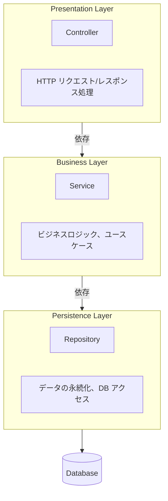
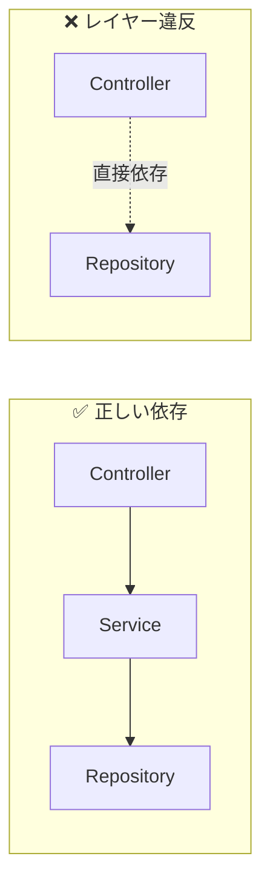
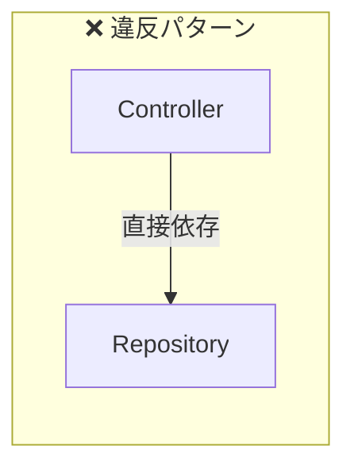
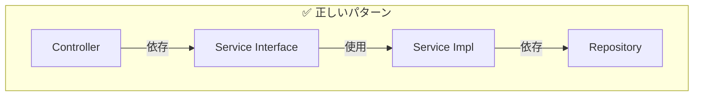
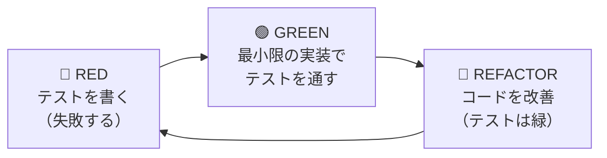
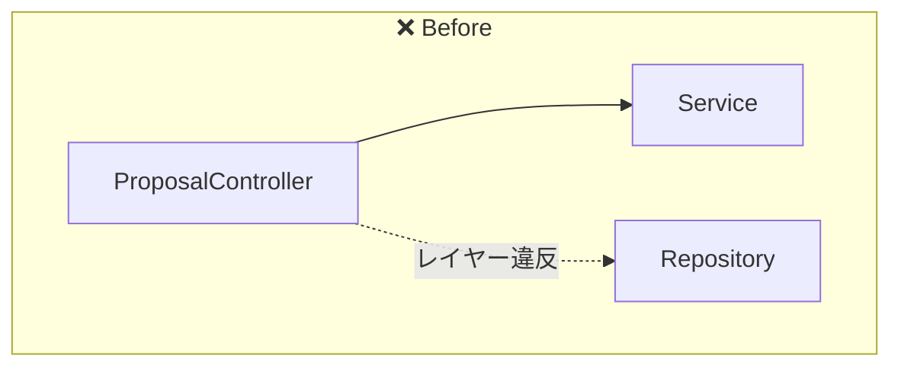
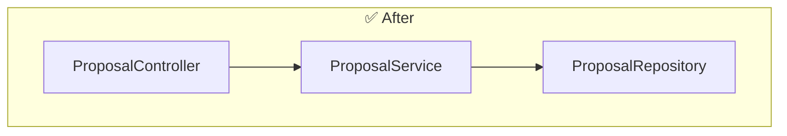
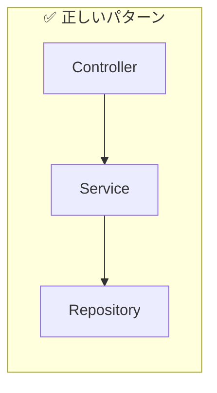

## はじめに

本記事では、Spring Boot アプリケーションにおける **レイヤードアーキテクチャ違反** を修正するリファクタリング事例を通じて、適切なレイヤー設計とその実装方法を解説します。

「Controller が Repository に直接アクセスしている」というコードを見たことはありませんか？一見動作するこのコードが、なぜ問題なのか、そしてどのように修正すべきかを、実際のコード例とともに詳しく説明します。

### この記事で学べること

- レイヤードアーキテクチャの基本概念と各レイヤーの責務
- Controller から Repository への直接依存がなぜ問題なのか
- SOLID 原則（特に依存性逆転の原則）との関連
- TDD（テスト駆動開発）によるリファクタリングの進め方
- Kotlin/Spring Boot での具体的な実装方法

### 対象読者

- Spring Boot でバックエンド開発を始めたジュニアエンジニア
- レイヤードアーキテクチャの概念は知っているが、実践方法がわからない方
- コードレビューで「レイヤー違反」を指摘されたことがある方

---

## 1. リファクタリングの背景

### 問題のあるコード

以下は、提案書（Proposal）のステータスを取得する API エンドポイントのコードです。

```kotlin
// ❌ Before: Controller が Repository に直接依存している
@RestController
@RequestMapping("/api/v1/proposals")
class ProposalController(
    private val proposalService: ProposalService,
    private val proposalRepository: ProposalRepository  // ← 問題: Repository に直接依存
) {

    @GetMapping("/{proposalId}/status")
    fun getProposalStatus(
        @PathVariable proposalId: String,
        @RequestAttribute("userId") userId: String
    ): ResponseEntity<ProposalStatusResponse> {
        // ❌ Controller から Repository を直接呼び出している
        val proposal = proposalRepository.findByIdAndUserId(proposalId, userId)
            ?: return ResponseEntity.notFound().build()

        return ResponseEntity.ok(
            ProposalStatusResponse(
                id = proposal.id,
                status = proposal.status,
                // ...
            )
        )
    }
}
```

このコードは **動作します** 。テストも通るかもしれません。では、何が問題なのでしょうか？

---

## 2. レイヤードアーキテクチャとは

### 2.1 基本構造

レイヤードアーキテクチャは、アプリケーションを **責務ごとに階層化** する設計パターンです。



### 2.2 各レイヤーの責務

| レイヤー | 責務 | Spring でのクラス |
|---------|------|------------------|
| **Presentation** | HTTP の処理、リクエスト/レスポンスの変換、入力バリデーション | `@RestController` |
| **Business** | ビジネスロジック、トランザクション管理、ユースケースの実装 | `@Service` |
| **Persistence** | データの永続化、DB クエリの実行、エンティティの CRUD | `@Repository` |

### 2.3 重要なルール：依存の方向は上から下のみ



**上位レイヤーは下位レイヤーに依存できますが、その逆は許されません。** また、 **レイヤーを飛び越えた依存も避けるべきです。**

---

## 3. なぜ Controller から Repository への直接依存が問題なのか

### 3.1 問題点一覧

| 問題 | 具体例 | 影響 |
|------|--------|------|
| **レイヤー責務の曖昧化** | ビジネスロジックが Controller に漏れ出す | 保守性の低下 |
| **テスタビリティの低下** | Controller テストで Repository のモックが必要 | テストが複雑化 |
| **変更の影響範囲拡大** | Repository の変更が Controller に直接影響 | 修正コストの増加 |
| **再利用性の低下** | 同じ DB アクセスロジックが複数箇所に分散 | DRY 原則違反 |
| **トランザクション管理の困難** | Service を介さないため、トランザクション境界が不明確 | データ整合性のリスク |

### 3.2 具体的なシナリオで考える

#### シナリオ 1: 認可ロジックの追加

「管理者ユーザーは全ての Proposal を見れるようにしたい」という要件が追加されたとします。

**Controller に Repository 依存がある場合:**

```kotlin
// ❌ Controller にビジネスロジックが漏れ出す
@GetMapping("/{proposalId}/status")
fun getProposalStatus(
    @PathVariable proposalId: String,
    @RequestAttribute("userId") userId: String,
    @RequestAttribute("userRole") userRole: String  // 新しく追加
): ResponseEntity<ProposalStatusResponse> {
    // ビジネスロジックが Controller に...
    val proposal = if (userRole == "ADMIN") {
        proposalRepository.findById(proposalId).orElse(null)
    } else {
        proposalRepository.findByIdAndUserId(proposalId, userId)
    }
    // ...
}
```

**Service を介する場合:**

```kotlin
// ✅ Controller はシンプルなまま
@GetMapping("/{proposalId}/status")
fun getProposalStatus(
    @PathVariable proposalId: String,
    @RequestAttribute("userId") userId: String
): ResponseEntity<ProposalStatusResponse> {
    val proposal = proposalService.getProposalForUser(proposalId, userId)
        ?: return ResponseEntity.notFound().build()
    // ...
}

// ✅ ビジネスロジックは Service に集約
@Service
class ProposalService {
    fun getProposalForUser(proposalId: String, userId: String): Proposal? {
        // 認可ロジックはここで一元管理
        val user = userService.getUser(userId)
        return if (user.isAdmin) {
            proposalRepository.findById(proposalId).orElse(null)
        } else {
            proposalRepository.findByIdAndUserId(proposalId, userId)
        }
    }
}
```

#### シナリオ 2: キャッシュの追加

「頻繁にアクセスされる Proposal はキャッシュしたい」という要件が追加されたとします。

**Service を介する場合、Controller を変更せずに対応可能:**

```kotlin
@Service
class ProposalService {
    @Cacheable("proposals")  // キャッシュ追加
    fun getProposalForUser(proposalId: String, userId: String): Proposal? {
        return proposalRepository.findByIdAndUserId(proposalId, userId)
    }
}
```

Controller は一切変更不要です。これが **レイヤー分離の恩恵** です。

---

## 4. SOLID 原則との関連

### 4.1 依存性逆転の原則（DIP: Dependency Inversion Principle）

> 上位モジュールは下位モジュールに依存してはならない。両者は抽象に依存すべきである。





### 4.2 単一責任の原則（SRP: Single Responsibility Principle）

> クラスを変更する理由は1つだけであるべき

Controller を変更する理由:
- HTTP エンドポイントの追加/変更
- リクエスト/レスポンス形式の変更
- 入力バリデーションの変更

Repository を変更する理由:
- データベーススキーマの変更
- クエリの最適化
- データアクセス方法の変更

**これらは別の変更理由であり、同じクラスが両方に依存すべきではありません。**

---

## 5. TDD によるリファクタリング実践

### 5.1 TDD の基本サイクル



### 5.2 Step 1: RED - 失敗するテストを書く

まず、新しい Service メソッドのテストを書きます。

```kotlin
@Nested
@DisplayName("getProposalForUser")
inner class GetProposalForUserTest {

    @Test
    @DisplayName("正常系: proposalId と userId が一致する Proposal を返す")
    fun `proposalId と userId が一致する Proposal を返す`() {
        // Arrange（準備）
        val proposalId = "test-proposal-id"
        val userId = "test-user-id"
        val expectedProposal = createProposal(id = proposalId, userId = userId)

        // モックの設定: Repository が呼ばれたら expectedProposal を返す
        every {
            mockProposalRepository.findByIdAndUserId(proposalId, userId)
        } returns expectedProposal

        // Act（実行）
        val result = service.getProposalForUser(proposalId, userId)

        // Assert（検証）
        assertEquals(expectedProposal, result)
        verify(exactly = 1) {
            mockProposalRepository.findByIdAndUserId(proposalId, userId)
        }
    }

    @Test
    @DisplayName("異常系: Proposal が見つからない場合 null を返す")
    fun `Proposal が見つからない場合 null を返す`() {
        // Arrange
        val proposalId = "non-existent-proposal"
        val userId = "test-user-id"
        every {
            mockProposalRepository.findByIdAndUserId(proposalId, userId)
        } returns null

        // Act
        val result = service.getProposalForUser(proposalId, userId)

        // Assert
        assertNull(result)
        verify(exactly = 1) {
            mockProposalRepository.findByIdAndUserId(proposalId, userId)
        }
    }

    @Test
    @DisplayName("異常系: userId が異なる場合 null を返す")
    fun `userId が異なる場合 null を返す`() {
        // Arrange
        val proposalId = "test-proposal-id"
        val requestingUserId = "different-user-id"
        every {
            mockProposalRepository.findByIdAndUserId(proposalId, requestingUserId)
        } returns null

        // Act
        val result = service.getProposalForUser(proposalId, requestingUserId)

        // Assert
        assertNull(result)
    }
}
```

この時点でテストを実行すると、`getProposalForUser` メソッドが存在しないため **コンパイルエラー** になります。これが RED（失敗）の状態です。

### 5.3 Step 2: GREEN - 最小限の実装

テストを通すために、Service にメソッドを追加します。

```kotlin
@Service
class ProposalService(
    private val proposalRepository: ProposalRepository,
    // ... 他の依存
) {
    /**
     * ユーザーに紐づく Proposal を取得する
     *
     * @param proposalId Proposal の ID
     * @param userId ユーザー ID
     * @return Proposal（見つからない場合または userId が一致しない場合は null）
     */
    fun getProposalForUser(proposalId: String, userId: String): Proposal? {
        return proposalRepository.findByIdAndUserId(proposalId, userId)
    }

    // ... 既存のメソッド
}
```

テストを実行すると、すべて **グリーン（成功）** になります。

### 5.4 Step 3: REFACTOR - Controller の修正

テストが通ったので、Controller から Repository への依存を削除します。

```kotlin
// ✅ After: Controller は Service のみに依存
@RestController
@RequestMapping("/api/v1/proposals")
class ProposalController(
    private val proposalService: ProposalService
    // proposalRepository は削除！
) {

    @GetMapping("/{proposalId}/status")
    fun getProposalStatus(
        @PathVariable proposalId: String,
        @RequestAttribute("userId") userId: String
    ): ResponseEntity<ProposalStatusResponse> {
        // ✅ Service を経由して取得
        val proposal = proposalService.getProposalForUser(proposalId, userId)
            ?: return ResponseEntity.notFound().build()

        return ResponseEntity.ok(
            ProposalStatusResponse(
                id = proposal.id,
                status = proposal.status,
                // ...
            )
        )
    }
}
```

---

## 6. Before / After 比較

### 6.1 依存関係の変化





### 6.2 コードの変化

#### Controller（import 文）

```diff
- import com.example.app.repository.ProposalRepository
  import com.example.app.service.ProposalService
```

#### Controller（コンストラクタ）

```diff
  class ProposalController(
-     private val proposalService: ProposalService,
-     private val proposalRepository: ProposalRepository
+     private val proposalService: ProposalService
  )
```

#### Controller（メソッド内）

```diff
  fun getProposalStatus(/* ... */): ResponseEntity<ProposalStatusResponse> {
-     val proposal = proposalRepository.findByIdAndUserId(proposalId, userId)
+     val proposal = proposalService.getProposalForUser(proposalId, userId)
          ?: return ResponseEntity.notFound().build()
```

#### Service（新規メソッド追加）

```kotlin
/**
 * ユーザーに紐づく Proposal を取得する
 *
 * @param proposalId Proposal の ID
 * @param userId ユーザー ID
 * @return Proposal（見つからない場合または userId が一致しない場合は null）
 */
fun getProposalForUser(proposalId: String, userId: String): Proposal? {
    return proposalRepository.findByIdAndUserId(proposalId, userId)
}
```

### 6.3 追加ボーナス: ハードコード値の削除

リファクタリングついでに発見した改善点も修正しました。

```diff
  ResponseEntity.status(HttpStatus.CREATED).body(
      ProposalResponse(
          id = proposal.id,
-         status = ProposalStatus.PENDING,  // ハードコード
+         status = proposal.status,         // エンティティの値を使用
          message = "提案生成リクエストを受け付けました。"
      )
  )
```

---

## 7. テストの書き方解説

### 7.1 MockK を使ったモック設定

```kotlin
// テストクラスのセットアップ
class ProposalServiceTest {

    private lateinit var service: ProposalService

    // MockK でモックを作成（relaxed = true で未設定メソッドもデフォルト値を返す）
    private val mockProposalRepository: ProposalRepository = mockk(relaxed = true)
    private val mockLambdaInvocationService: LambdaInvocationService = mockk(relaxed = true)

    @BeforeEach
    fun setup() {
        // テスト対象のサービスを初期化（モックを注入）
        service = ProposalService(
            mockProposalRepository,
            mockLambdaInvocationService,
            // ...
        )
    }
}
```

### 7.2 Arrange-Act-Assert パターン

テストは以下の3つのセクションで構成します:

```kotlin
@Test
fun `テストケース名`() {
    // ============================================
    // Arrange（準備）: テストに必要なデータとモックを設定
    // ============================================
    val proposalId = "test-proposal-id"
    val userId = "test-user-id"
    val expectedProposal = createProposal(id = proposalId, userId = userId)

    every {
        mockProposalRepository.findByIdAndUserId(proposalId, userId)
    } returns expectedProposal

    // ============================================
    // Act（実行）: テスト対象のメソッドを呼び出す
    // ============================================
    val result = service.getProposalForUser(proposalId, userId)

    // ============================================
    // Assert（検証）: 期待する結果を検証
    // ============================================
    assertEquals(expectedProposal, result)
    verify(exactly = 1) {
        mockProposalRepository.findByIdAndUserId(proposalId, userId)
    }
}
```

### 7.3 テストケースの設計指針

| カテゴリ | テストすべきこと | 例 |
|---------|------------------|------|
| **正常系** | 期待通りの入力で期待通りの出力 | ID と userId が一致 → Proposal を返す |
| **異常系（存在しない）** | リソースが存在しない場合 | 存在しない ID → null を返す |
| **異常系（認可）** | 権限がない場合 | 他人の userId → null を返す |
| **境界値** | 特殊な入力値 | 空文字、null、最大長など |

---

## 8. よくある質問

### Q1: 「Service が Repository をそのまま呼ぶだけ」でも意味があるの？

**A: はい、意味があります。**

一見「パススルー」に見えるメソッドでも、以下のメリットがあります:

1. **将来の拡張性**: 後でキャッシュ、ログ、認可ロジックを追加しやすい
2. **レイヤーの一貫性**: 全てのデータアクセスが Service を経由する規約
3. **テスタビリティ**: Controller のテストで Repository のモックが不要

### Q2: 全ての Repository メソッドに対応する Service メソッドが必要？

**A: いいえ、必要に応じて追加します。**

Controller から使用する Repository メソッドのみ、Service にラッパーメソッドを用意します。Service 内部でのみ使う Repository メソッドはそのままで OK です。

### Q3: Repository への依存は常に悪？

**A: Controller から Repository への直接依存は避けるべきですが、Service から Repository への依存は正常です。**



- `Controller → Repository`: 避けるべき
- `Service → Repository`: これは OK

---

## 9. まとめ

### リファクタリングで達成したこと

| Before | After |
|--------|-------|
| Controller が Repository に直接依存 | Controller は Service のみに依存 |
| レイヤードアーキテクチャ違反 | 正しいレイヤー構造 |
| ビジネスロジックが分散 | Service に集約 |
| テストで Repository モックが必要 | Service のモックのみで OK |

### 学んだ原則

1. **レイヤードアーキテクチャ**: 依存の方向は上から下のみ
2. **依存性逆転の原則（DIP）**: 具象ではなく抽象に依存
3. **単一責任の原則（SRP）**: 変更理由は1つだけ
4. **TDD**: テストファースト → 実装 → リファクタリング

### チェックリスト

次のコードレビューで確認すべきポイント:

- [ ] Controller が Repository に直接依存していないか？
- [ ] ビジネスロジックが Controller に漏れ出していないか？
- [ ] 新しい Service メソッドにテストがあるか？
- [ ] KDoc コメントが適切に書かれているか？

---

## 参考資料

- [Clean Architecture（Robert C. Martin）](https://blog.cleancoder.com/uncle-bob/2012/08/13/the-clean-architecture.html)
- [Spring Boot Reference Documentation](https://docs.spring.io/spring-boot/docs/current/reference/html/)
- [MockK Documentation](https://mockk.io/)
- [SOLID 原則入門](https://en.wikipedia.org/wiki/SOLID)

---

*この記事は、実際のプロダクションコードのリファクタリング経験を元に作成しました。*
