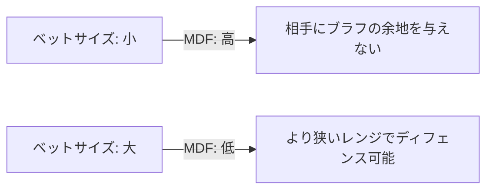

## イントロダクション

GTO（Game Theory Optimal）ソルバーが出力する数字を見て、「なるほど、ここでは 43% ディフェンスするのか」と暗記していませんか？それらの数字がどこから来ているのか、なぜその頻度なのか、そして実戦でどう応用すべきかを理解していますか？

本記事では、GTO 理論における**最小ディフェンス頻度（Minimum Defense Frequency, MDF）**の数学的基礎を解説し、その知識をアンノウンプレイヤーが多いトーナメント環境でどう活かすかを探ります。

**想定読者**：
- ポーカー中級者以上で、GTO の概念に触れたことがある方
- 理論の「なぜ」を理解したい方
- 数学的な説明に興味がある初学者も歓迎

単に数字を真似るのではなく、その背後にある原理を理解することで、状況に応じた柔軟な判断ができるようになります。

## MDF（最小ディフェンス頻度）とは何か

### 定義

**最小ディフェンス頻度（MDF）**とは、相手のブラフを期待値ゼロ（0 EV）にするために、あなたが最低限ディフェンスすべき頻度のことです。

言い換えれば、相手があなたに対してブラフする誘因をなくすための最小頻度です。もしあなたが MDF 以下の頻度でしかディフェンスしなければ、相手はエニーツーハンドでブラフしても利益が出てしまいます。

### 数学的導出

相手がブラフした場合、以下の 2 つの結果が考えられます：

- **あなたがフォールド**：相手はポット $P$ を獲得
- **あなたがコール**：相手はベット額 $B$ を失う

相手のブラフの期待値（EV）は：

$$
\text{Bluff EV} = (\text{fold\%}) \times P - (\text{call\%}) \times B
$$

ここで、$\text{fold\%} + \text{call\%} = 1$ なので、$\text{call\%} = 1 - \text{fold\%}$ です。

ブラフを 0 EV にするには：

$$
(\text{fold\%}) \times P - (1 - \text{fold\%}) \times B = 0
$$

これを $\text{fold\%}$ について解きます：

$$
(\text{fold\%}) \times P = (1 - \text{fold\%}) \times B
$$

$$
(\text{fold\%}) \times P = B - (\text{fold\%}) \times B
$$

$$
(\text{fold\%}) \times (P + B) = B
$$

$$
\text{fold\%} = \frac{B}{P + B}
$$

したがって、**ディフェンス頻度（call%）**は：

$$
\text{MDF} = 1 - \text{fold\%} = 1 - \frac{B}{P + B} = \frac{P}{P + B}
$$

**結論**：

$$
\text{MDF} = \frac{P}{P + B}
$$

ここで：
- $P$ = ベット前のポットサイズ
- $B$ = ベットサイズ

### 具体例：リバーで 2/3 ポットベット

リバーで相手が 2/3 ポットベットをしてきた場合を考えます。

- ポットサイズ $P = 100$
- ベットサイズ $B = \frac{2}{3} \times 100 = 66.67$

MDF を計算します：

$$
\text{MDF} = \frac{P}{P + B} = \frac{100}{100 + 66.67} = \frac{100}{166.67} \approx 0.60 = 60\%
$$

つまり、少なくとも **60% の頻度でディフェンス**しなければ、相手はエニーツーでブラフしても利益が出てしまいます。

### ベットサイズと MDF の関係

ベットサイズが変わると、MDF も変化します。以下の表は、ポット比率でのベットサイズに対応する MDF を示しています。

| ベットサイズ（ポット比） | MDF |
|-------------------------|-----|
| 25% | 80.0% |
| 50% | 66.7% |
| 66% | 60.0% |
| 75% | 57.1% |
| 100% | 50.0% |
| 150% | 40.0% |

**グラフで視覚化**：

ベットサイズが小さいほど、MDF は高くなります（広くディフェンスする必要がある）。逆に、ベットサイズが大きいほど、MDF は低くなります（狭いレンジでディフェンスできる）。

## プリフロップの BB ディフェンスへの応用

### 2BB オープンに対する MDF の計算

プリフロップで、CO から 2BB オープンがあり、BTN と SB がフォールドして BB に回ってきた状況を考えます。

**既存ポット**：
- SB のブラインド: 0.5BB
- BB のブラインド: 1BB
- 合計: **1.5BB**

**オープンサイズ**: 2BB

MDF を計算します：

$$
\text{MDF} = \frac{P}{P + B} = \frac{1.5}{1.5 + 2} = \frac{1.5}{3.5} \approx 0.429 = 42.9\%
$$

つまり、BB は少なくとも **42.9% の頻度でディフェンス**する必要があります。逆に言えば、BB が 57% 以上フォールドすると、相手はエニーツーハンドでオープンしても fold equity だけで +EV になってしまいます。

### 頻度とレンジの関係

「頻度」と「レンジ」の関係を整理しましょう。

- **頻度**：特定のアクションを取る「割合」（例：42.9%）
- **レンジ**：その頻度を達成するための「具体的なハンドの集合」

**42.9% ディフェンス**とは、BB のハンドレンジの上位約 43% で守るということです。具体的には：

- 全ハンド（169 通りのコンビネーション）のうち
- 上位約 72 ハンド（43%）でコールまたは 3bet
- 残り 97 ハンド（57%）でフォールド

### オープンサイズ別 MDF の表

オープンサイズが変わると、MDF も変化します。

| オープンサイズ | MDF（必要ディフェンス頻度） |
|--------------|---------------------------|
| 2.0BB | 42.9% |
| 2.5BB | 37.5% |
| 3.0BB | 33.3% |
| 4.0BB | 27.3% |

オープンサイズが大きくなるほど、必要なディフェンス頻度は低くなります。これは直感的にも理解できます：相手が大きくベットするほど、あなたはタイトにディフェンスしても相手のブラフを阻止できます。

### プリフロップとリバーの比較

興味深い点として、**2.5BB のオープンは、ポット（1.5BB）に対して約 167% のベット**に相当します。

$$
\frac{2.5}{1.5} \approx 1.67 = 167\%
$$

リバーでポットの 167% をベットすることは稀ですが、プリフロップではこれが標準的なサイズです。この違いは、プリフロップとポストフロップの性質の違いから来ています。

## プリフロップのオープンサイズが大きい理由

なぜプリフロップでは「ポット比で大きなベット」が標準的なのでしょうか？

### 1. 残りストリート数

プリフロップの時点では、**フロップ・ターン・リバーの 3 ストリート**が残っています。大きいポットを作ることで、スタックオフ（オールイン）しやすくなります。

例えば、100BB スタックで 2.5BB オープンすると、ポットは 5.5BB（SB 0.5 + BB 1 + オープン 2.5 + コール 2.5）になります。そこから 3 ストリートでベットを重ねれば、自然にスタックを投入できます。

### 2. マルチウェイ回避

オープンサイズが小さいと、複数のプレイヤーがコールしやすくなります（マルチウェイ）。マルチウェイになると：

- 自分のハンドのエクイティが希薄化
- ポストフロップで複雑な状況になる
- ブラフが通りにくくなる

大きめのオープンで 1 人だけコールさせる（ヘッズアップ）方が、ポストフロップのプレイがシンプルになります。

### 3. ポジションプレミアム

ポジションがない（OOP: Out Of Position）プレイヤーに、より高いコストを払わせることができます。特に BB は OOP で全ストリートをプレイしなければならないため、大きいオープンはポジションのアドバンテージを最大化します。

## ソルバーの「2BB 推奨」の前提と限界

多くの GTO ソルバーは、プリフロップのオープンサイズとして **2-2.2BB** を推奨します。しかし、これには前提条件があります。

### ソルバーの前提

1. **相手も GTO でプレイする**
   - オープンサイズを上げても、相手は防衛頻度を適切に調整するだけ
   - サイズを大きくしてもエクスプロイトできない

2. **ヘッズアップ想定**
   - マルチウェイの考慮が薄い
   - 1 対 1 の状況を最適化している

3. **レーキ最適化**
   - 小さいポットでレーキを抑える（特にオンラインキャッシュゲーム）
   - レーキが高い環境では、ポットを小さく保つことが重要

### 現実との乖離

実際のゲーム、特にライブトーナメントでは：

- **レクリエーショナルプレイヤー**は「安いからコール」でマルチウェイになりがち
- 3BB にしても防衛頻度はあまり変わらない（調整しないから）
- 大きいオープンの方が **fold equity** が高い場合が多い

### 重要なメッセージ

**ソルバーの数字を理解せずに使うと、逆にエッジを失う可能性があります。**

- なぜその数字なのか？
- 前提条件は何か？
- 自分のゲーム環境に合っているか？

これらを考えずに盲目的に従うと、搾取可能な相手に対して利益を取りこぼします。

## MDF の限界 - 相手のレンジに依存する

### 「常に MDF 以上で守るべき」は間違い

MDF はあくまで**相手のブラフを 0 EV にするための頻度**です。しかし、実戦では相手のレンジを考慮しなければなりません。

### 極端な例：相手が AA のみでオープン

もし相手が AA のみでオープンしている場合を考えます。

- MDF 的には 42.9% でディフェンスすべき
- しかし、AA に対して広くディフェンスしたら大損

**相手のレンジを考慮しない MDF は無意味です。**

### フィルター効果

プリフロップで BB に到達するまでに、多くのプレイヤーがアクションしています：

1. UTG がオープン
2. CO がフォールド
3. BTN がフォールド
4. SB がフォールド
5. BB にアクション

途中のプレイヤー（CO, BTN, SB）がフォールドするたびに、オープナーのレンジが「強い」と推測されます（**フィルター効果**）。

- BTN なら 3bet できる強いハンドがあればリレイズしていたはず
- SB も同様

つまり、**UTG オープンが BB に到達した時点で、そのレンジは BTN オープンよりも強い可能性が高い**です。したがって、BB は狭くディフェンスすべきです。

### ポジション別の目安

| オープナー | 想定レンジ | BB ディフェンス |
|-----------|-----------|----------------|
| UTG | タイト（10-15%） | 狭く（35-40%） |
| CO | ミドル（20-25%） | 中程度（40-45%） |
| BTN | ワイド（40-50%） | 広く（45-50%） |

これらは目安であり、実際のプレイヤーの傾向を観察して調整します。

## アンノウンプレイヤー相手のエクスプロイト戦略

### 問題：アンノウン = 情報がない → GTO に戻るべき？

トーナメントでは、初対面のプレイヤー（アンノウン）と対戦することが多いです。情報がない場合、「GTO に戻る」のが安全だと思われがちです。

### 答え：必ずしもそうではない

**GTO は無限サンプルで搾取されない戦略**ですが、トーナメントのハンド数は有限（数百〜数千ハンド）です。

### 収束しない範囲で負ける問題

相手が GTO から大きく外れている場合：

- エクスプロイトしないと期待値を取りこぼす
- 短期（数百ハンド）では分散が大きい
- GTO を守っていても、相手の間違いから利益を得られない

### タイトすぎる相手への対応

相手が MDF よりも少ない頻度でしかディフェンスしていない場合：

- **ディフェンス頻度を下げる**（フォールドエクイティを与えても良い）
- マージナルハンドはフォールド
- 3bet ブラフを減らす
- 相手がフォールドしすぎるので、自分もブラフを増やす

### ルースすぎる相手への対応

相手が MDF よりも多い頻度でディフェンスしている場合：

- **ディフェンス頻度を上げる**（相手のレンジが広いので、自分のエクイティも高い）
- マージナルハンドでもコール
- バリュー 3bet を増やす
- ブラフを減らす（相手がコールしすぎるため）

### 初期的な推測の指針

初対面のプレイヤーに対して、以下を観察します：

1. **オープン頻度**：最初の数ハンドでどれくらいオープンしているか
2. **ベットサイズの傾向**：標準的か、極端に大きい/小さいか
3. **ポジションへの意識**：EP と LP で明確に差があるか

これらの観察から、相手が GTO に近いか、タイト/ルースかを推測します。

## トーナメント特有の考慮事項

### ICM（Independent Chip Model）

トーナメントでは、**チップの価値 ≠ 賞金の期待値**です。

**ICM の基本概念**：
- チップを失うコスト > チップを得る価値（非線形）
- バブル付近や賞金ジャンプが大きい場面で特に重要

**具体例**：
- 10,000 チップ持ちで 5,000 チップ失うダメージ > 5,000 チップ得るメリット
- よって、マージナルな状況ではタイトにディフェンス

ICM を考慮すると、MDF よりも狭くディフェンスすることが正当化されます。

### スタックサイズの影響

**ショートスタック（15-25BB）**：
- ポストフロップの余地が少ない
- プッシュ/フォールド or 小さい 3bet → オールイン
- MDF よりも**オールインエクイティ**を重視

**ミドルスタック（30-50BB）**：
- 標準的な MDF 計算が適用しやすい
- ただし ICM を考慮

**ディープスタック（100BB+）**：
- ポストフロップのスキルエッジを活かせる
- スペキュラティブハンド（小ペア、スーテッドコネクター）の価値が上がる
- 広めにディフェンスしてポストフロップで勝負

## 実践的なガイドライン

### ディフェンス = コール + 3bet

MDF を満たすために、**コールだけでなく 3bet も含めます**。

例：40% ディフェンス = 30% コール + 10% 3bet

### 3bet の役割

- **バリュー**：プレミアムハンド（AA, KK, AK など）
- **ブラフ**：ブロッカーを持つハンド（A5s, A4s など）
- **ポラライズ**：中間のハンド（KQ, 99 など）はコール

### 具体的なハンド例（BTN 2.5BB オープン vs BB）

**コールすべきハンド**：
- ミドルポケットペア（55-99）
- スーテッドコネクター（76s, 87s, T9s など）
- スーテッド Ax（A2s-A9s の一部）
- KQ, QJ などのブロードウェイ

**3bet すべきハンド**：
- **バリュー**：JJ+, AQs+, AKo
- **ブラフ**：A5s, A4s, K5s（ブロッカー効果）

**フォールドしてもよいハンド**：
- オフスーツの弱いハンド（Q3o, J4o など）
- 相手がタイトな場合のマージナルハンド（K9o, Q8s など）

これらは一般的なガイドラインであり、相手のプレイスタイルやスタックサイズに応じて調整します。

## よくある間違い

### 1. MDF を機械的に守ろうとする

相手のレンジを無視して頻度だけを追うと、不利な状況でディフェンスしすぎてしまいます。

**修正**：相手のレンジを推測し、MDF はあくまで参考値として使う。

### 2. ソルバーの数字を暗記して思考停止

前提条件を理解せずに適用すると、環境に合わない戦略を取ってしまいます。

**修正**：なぜその数字なのかを理解し、自分のゲーム環境に合わせて調整。

### 3. アンノウン = GTO という誤解

情報がないからといって GTO が最適とは限りません。

**修正**：相手の初期的な傾向を観察し、エクスプロイトの余地を探る。

### 4. ディフェンス = コールのみ

3bet を忘れて頻度が足りなくなると、相手にブラフの余地を与えてしまいます。

**修正**：コールと 3bet を組み合わせてディフェンス頻度を確保。

### 5. トーナメント要因を無視

ICM やスタックサイズを考慮しないと、チップ EV は良くても賞金 EV が悪くなります。

**修正**：バブルや賞金ジャンプを意識し、必要に応じてタイトに調整。

## まとめ

MDF の数学的理解は、ポーカー戦略の強力な武器になります。

**重要なポイント**：

$$
\text{MDF} = \frac{P}{P + B}
$$

- ベットサイズが小さいほど、広くディフェンスする必要がある
- ベットサイズが大きいほど、狭くディフェンスできる

**しかし、実戦では状況に応じた調整が不可欠**：

1. **相手のレンジを考慮**：タイトなレンジには狭く、ワイドなレンジには広くディフェンス
2. **ポジションを考慮**：EP オープンには狭く、BTN オープンには広くディフェンス
3. **スタックサイズを考慮**：ショートスタックではオールインエクイティ重視
4. **ICM を考慮**：バブルや賞金ジャンプではタイトに調整

**特にアンノウンが多いトーナメントでは**：

- GTO ベースラインに固執すると損をする
- 相手の初期的な傾向を観察し、エクスプロイトを試みる
- ただし、情報が増えるにつれて戦略を調整

**理論を学び、実戦で応用する柔軟性を持つ**ことが、長期的な成功への鍵です。MDF はスタート地点であり、そこから状況に応じて調整していくことで、真のポーカースキルが磨かれます。

---

**次のステップ**：

- 実際のハンド履歴を見直し、自分のディフェンス頻度を確認する
- ソルバーで特定のスポットを研究し、MDF との関係を理解する
- ライブやオンラインで相手のディフェンス傾向を観察し、エクスプロイトを試みる

ポーカーは数学だけでなく、心理戦でもあります。理論を土台に、実戦で経験を積んでいきましょう。
